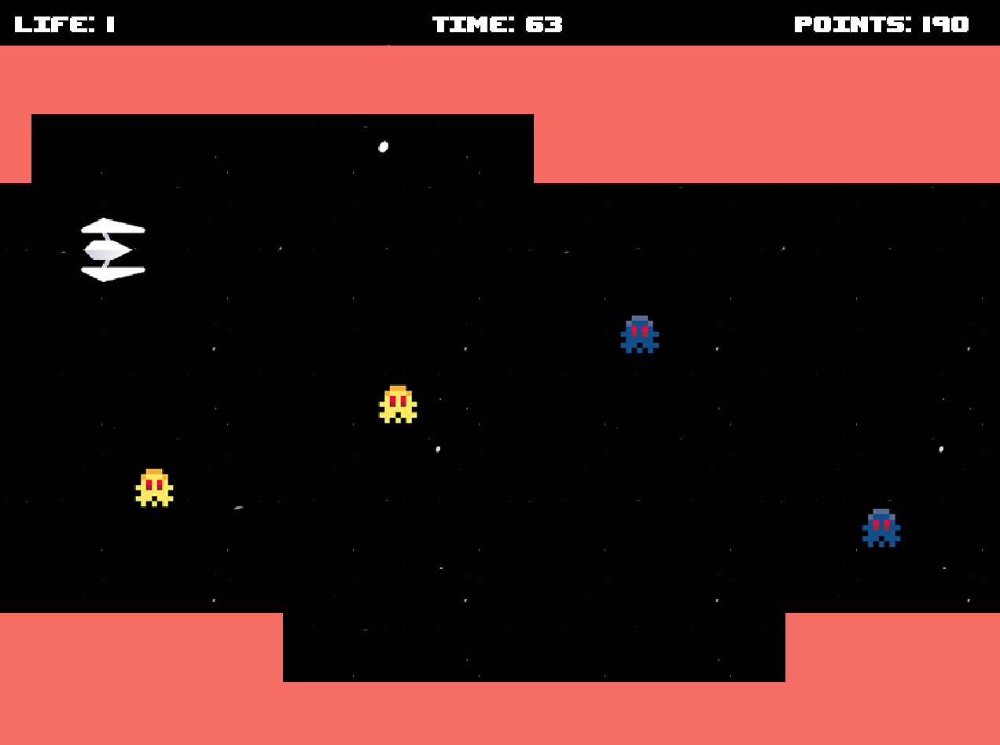

# Scramble Game (Java)

Um jogo 2D desenvolvido em Java inspirado no clássico **Scramble (1981)** da Konami. Este projeto foi criado como desafio final da disciplina de Computação Gráfica, utilizando a biblioteca **Swing** para renderização e desenho dos elementos visuais.

## 🎮 Descrição

O jogo consiste em um ambiente side-scrolling onde o jogador controla uma nave que deve desviar de obstáculos, coletar itens e evitar colisões. O objetivo é alcançar a maior pontuação possível, sobrevivendo o máximo de tempo no ambiente.



## 🛠️ Tecnologias Utilizadas

- **Java**: Linguagem de programação principal.
- **Swing**: Para renderização e criação dos elementos gráficos.
- **Game Loop**: Para gerenciar atualização e renderização do jogo em tempo real.

## 🚀 Funcionalidades

- Movimentação fluida do jogador.
- Disparos intercalados.
- Gerenciamento de colisões entre objetos.
- Sistema de pontuação.
- Obstáculos dinâmicos e interativos.
- Cores dinâmicas no ambiente.

## 🎮 Como Jogar

- **Controles**:
  - Utilize as setas do teclado (ou o famoso WASD) para movimentar a nave.
  - Pressione SPACE no seu teclado para disparar contra os inimigos.

- **Objetivo**:
  - Desviar dos inimigos.
  - Aumentar a pontuação através de eliminações.
  - Sobreviver pelo maior tempo possível. 

## 📥 Instalação e Execução

1. Clone este repositório:
   ```bash
   git clone https://github.com/lukaskardeck/scramble-game-java.git
   ```

   ou faça o download do projeto em um ZIP.

2. Abra o projeto em uma IDE de sua preferência, como VS Code.

3. Navegue até o arquivo src/main/Main.java.
Execute o arquivo Main.java diretamente pela IDE.

## 🔮 Melhorias Futuras

- Adicionar níveis com dificuldade progressiva.
- Adicionar diferentes tipos de inimigos.
- Adicionar diferentes tipos de disparos.
- Adicionar sons de colisão e músicas de fundo.
- Implementar uma interface gráfica mais interessante para o menu inicial e de opções.

## 🧑‍💻 Autor

Desenvolvido por **Lukas Kardeck**, como parte de um projeto acadêmico. 

Este projeto foi uma oportunidade de explorar conceitos de Computação Gráfica, organização de código e desenvolvimento de jogos 2D. Feedbacks e contribuições são bem-vindos!